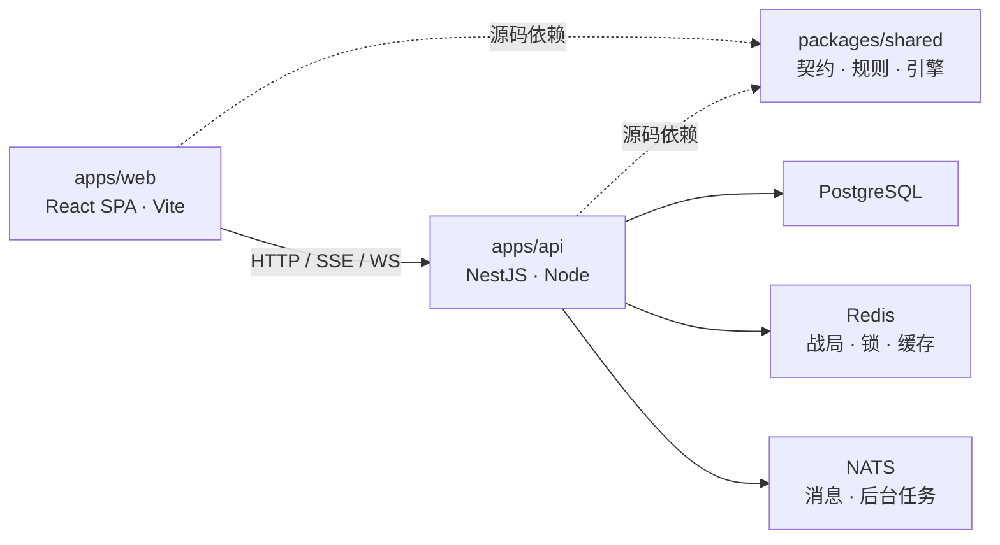

# Monorepo 架构审查与整理记录

审查日期：2026-10-03。目标：NestJS 后端 + React SPA/Vite + pnpm workspace + Turborepo。

第 1—6 节保留前次架构整理的审查与验证记录；第 7 节记录按推荐顺序实施的后续六个阶段。本文区分首次审查发现和各轮重构后的状态。代码、依赖图、构建产物与本地运行是判断依据；历史迁移文档不等同于生产验收。本轮改动保留在工作区，尚未发布。

## 1. 结论

仓库的应用划分、依赖归属和交付方式符合目标架构，可以继续沿用三个工作区。API 是单个 Nest 部署单元，SPA 独立交付，共享包提供契约与领域计算。当前业务规模不足以证明需要进一步拆服务或增加公共包。

首次审查的主要不足在应用内部：业务实现集中在后端 `lib/services`，Nest 入口与实际领域归属脱节；shared 对外公开范围过宽；游戏布局的静态导入扩大 SPA 入口；请求约定隐藏在全局 fetch 改写中；质量检查没有进入 PR 工作流。

本轮已完成领域归位、主要入口依赖注入、已发现循环的拆解、shared 包解析和核心边界约束、SPA 加载边界、显式请求入口及质量检查工作流。保留单一数据库池、事务/资源提交、Redis 战局权威与现有消息生命周期。生产迁移和发布验收仍按原计划执行。

## 2. 当前拆分

| 位置 | 职责 | 判断 |
| --- | --- | --- |
| 根目录 | 锁文件、workspace、Turbo、lint/test、维护和迁移配置、CI/CD | 仓库级工具管理合理；工具使用 shared 时也声明 workspace 依赖 |
| `apps/api` | Nest HTTP/SSE/WS、认证、应用编排、持久化、Redis、NATS、LLM、调度 | 独立后端，不承担 SPA 渲染 |
| `apps/web` | React 19 SPA、React Router、浏览器状态、游戏 UI、静态资源 | Vite 独立构建，无 SSR/Next.js 层 |
| `packages/shared` | Zod 契约、类型、规则、引擎、内容、共同业务展示计算 | 内部 TypeScript 源码包，应用构建时打包，不独立运行 |
| `drizzle` / `drizzle-auth` | 业务表和 Better Auth 的独立迁移流 | 所有权不同，保持独立合理 |
| `docker` / `scripts` | API 镜像、本地基础设施、发布和维护入口 | 与前端静态交付分离 |

本轮整理后，生产 TS/TSX 源码约为 API 533 文件/8.30 万行、Web 564 文件/8.44 万行、shared 540 文件/6.76 万行；统计排除测试与声明文件，行数包含注释。shared 另有 237 个测试文件。

应用不互相导入，shared 不反向依赖应用。`@app`、`@server` 只用于各自宿主；shared 通过 workspace 包的 `exports` 解析，TS、Vite、Vitest 均不再以源码别名绕过包边界。

## 3. 后端架构

### 功能与应用实现

外层 Controller、Guard、Pipe、Filter、Interceptor 已使用 Nest。功能模块由 `app.module.ts` 组装。认证采用全局 `AccessGuard` 与 `@Access`，Better Auth 原始认证请求保留独立处理；框架异常映射和显式构造器 `@Inject` 与当前 Rspack 编译配置一致。

首次审查时 `lib/services` 有 191 文件、约 4.67 万行。业务实现可以不经过 Nest Module 的依赖声明跨目录调用，维护者难以判断归属。

本轮将 188 个领域及广播文件按实际用途归位：

- 背包、炼丹、炼器、邮件、交易、任务、叙事、角色等实现进入所属 feature 的 `application/`。
- 宗门组织进入 `sects/organization/`，战斗编排进入 `combat/application/`。
- 广播、在线状态及 NATS 实时适配进入 `realtime/infrastructure/`。
- `lib/services` 只保留五个文件、约 1120 行，负责命令协调、资源读取/提交/响应和通用资源引擎。

文件归位主要改动导入路径。领域函数、纯计算和无状态应用对象保持框架无关；Nest Service 负责请求边界、依赖组合和响应适配。宗门的现有应用组合通过 `SECT_ORGANIZATION` Provider 注入，避免重复创建另一套对象。

这仍是一个模块化单体。源码函数的跨功能复用不自动要求创建额外 Nest Provider；新增需要替换或有状态的依赖应通过明确的模块导出、Provider 或领域 port 提供。目录归位不意味着所有跨领域依赖已变成独立模块的公开 API。

### 配置与数据库

`ConfigurationModule` 使用 `@nestjs/config`，禁用 dotenv 自动发现与 ConfigService 的 process.env 回退，保留一次 Zod 校验后的不可变快照。`AppConfigService.get()` 是 Nest 的类型化配置入口。启动、cron、开发工具与需要环境判断的参数管道/异常映射使用注入配置；独立基础库和维护命令使用同一 `getRuntimeEnvironment()` 快照。

`DatabaseModule` 通过 `DRIZZLE_DATABASE` Provider 导出既有 Drizzle 客户端。Nest 中直接执行 SQL 的服务和版本化资源读取入口显式注入客户端并向下传递。框架无关的应用函数与仓储仍可使用同一客户端作为默认执行器，未建立第二个 Pool。写路径继续传递 `DbExecutor`/`DbTransaction`，`runDbTasks` 保留事务连接内串行语义。

数据库注入不能取代事务、角色锁、幂等与资源提交。重构这些入口时应保留调用方传入的执行器，不在事务内部退回默认客户端。

### 依赖方向与生命周期

已拆解首次发现的四组运行值依赖环：灵田错误定义、宗门任务入场/结算组合、游戏壳聚合导入、战斗核心查询/状态移除。重新分析 1637 个生产源码文件，未发现静态运行值导入循环或直接应用越界导入。此结果不证明不存在动态调用或运行时状态依赖。

世界/宗门聊天仓储现在只负责存储，`social/application/chatDelivery.ts` 在保存完成后调用原广播。所有原调用方保持相同保存与发布顺序；未新增 outbox 或改变聊天的交付保证。物品库采样键移到中性工具目录，仓储不再反向调用应用服务。

`RuntimeService` 仍统一管理消息、调度及停机，先排空请求/消息再关闭数据库和 Redis。基础设施单例的存在有用途，应通过现有生命周期管理，避免功能内另建客户端。

## 4. shared 与 React SPA

### shared

共享规则使客户端预览与服务端裁定使用同一套计算，保留一个 shared 包有实际收益。本轮将 `cn`、`clsx`、`tailwind-merge` 归 Web，shared 运行依赖只保留 Zod 与数字格式化工具。

包入口采用明确的领域入口及领域范围的子路径，不再提供任意源码路径的总通配入口。combat core、content、projection、rules-daoyou 的内部子路径默认不公开；确有消费者的轻量查询/编辑器叶子入口单独声明。包内受保护实现通过相对路径协作，宿主通过公共入口使用。

ESLint 增加三类规则：shared 禁止宿主/服务端基础设施及 UI 技术依赖；combat core 禁止上层规则、内容、投影和旧战斗引擎，禁止直接 `Math.random`/`Date.now`；仓储禁止调用应用服务。Nest Service 也不能直接导入默认 `db`/`getExecutor`。

资源 registry 仍集中维护协议和运行时 schema。入口优化后没有证据要求立刻拆散该协议；后续若分析证明某类 schema 显著扩大热路径，再保持协议一致性地优化。旧规则部分时间/随机 helper 已支持参数传入，少量历史便捷函数仍有默认随机行为；需要录像复现的战斗 core 已有种子 RNG 和明确约束。未在架构整理中调整随机算法或游戏数值。

### SPA

保留 `createRoot`、集中式 `createBrowserRouter`/`lazyRoute`、scene metadata、多类游戏布局以及既有资源 Store。角色身份、场景任务和底部导航仍按既有 UI 规范分离。

游戏布局现在随路由分支加载；HUD 的轻量炼体摘要与完整详情面板分开，详情可形成独立 chunk。下表为两次构建产物分析，非加载耗时测量，gzip 为各文件压缩大小的合计：

| 指标                     |   首次审查 |             本轮重构后 |
| ------------------------ | ---------: | ---------------------: |
| 主入口 JS                |  约 708 KB |              约 306 KB |
| 入口可达静态 JS 合计     | 约 1445 KB |              约 449 KB |
| 静态 JS 逐文件 gzip 合计 |  约 413 KB |              约 143 KB |
| Phaser 地图 chunk        | 约 1375 KB | 约 1375 KB，保持懒加载 |

入口静态 JS 约减少 69%。`BodyCultivationPanels` 动态/静态导入冲突警告已消除。地图包仍触发体积提示，应根据实际地图加载体验评估；本轮未为隐藏提示而调整阈值。

HTTP 业务调用统一到显式 `apiFetch`，全局 fetch 保持原生。API 地址、Cookie 默认值、BYOK header 和 Request/URL 行为在一处处理。非 API 请求保持原调用语义；认证 SDK、SSE、WS 保留专用适配。改写 Request 的目标 URL 时缓冲请求体，避免普通 POST 被变成不受当前 HTTP 链路支持的流式上传。

## 5. 数据权威与交付

PostgreSQL 管理长期角色/资产/资源版本和回放。Redis 管理活跃战局、占用和锁。NATS 管理后台消费、领域事件和战局终局/回放交付。这些设施的复杂度与业务用途匹配，目前继续放在同一 API 部署单元合理。

生产配置必须提供 Redis 地址；readiness 仅在 Redis 为 up 时通过，不再把 disabled 视为游戏就绪。本地实测 PostgreSQL、Redis、NATS、消息设施均为 up；生产配置缺失 Redis 时进程明确拒绝启动。

旧表和资产迁移入口按实际调用及发布政策保留，本轮未新增或执行数据库迁移。历史附件样本等数据问题仍需单独验收，不能由代码构建通过推导生产数据兼容。

新增 `quality.yml` 在 PR 和 master 推送时执行 frozen install、lint、完整类型检查、shared 测试和双应用构建。工作流已配置，本轮未触发远端 GitHub 运行；是否成为必需合并检查还取决于仓库分支保护设置。

原 tag 发布工作流保持不变：发布 tag、commit SHA 及 **latest**，每次成功构建始终更新 latest。latest 便于部署，但发布记录和回滚应同时记录不可变 tag/SHA/digest。

建议沿用以下兼容发布顺序：

1. 对新增契约先部署兼容旧 SPA 的 API；数据库变化先采用可兼容旧代码的扩展迁移。
2. 确认 API readiness、认证、实时连接和资源协议后发布新 SPA，记录前后端 build ID 与镜像 digest。
3. 保留旧 SPA/旧镜像回滚窗口；旧字段/表删除延后到旧客户端和旧消息不再需要时。
4. 若涉及不可逆迁移，回滚计划须先明确数据策略；镜像回滚本身不会撤销数据变更。

## 6. 本轮验证和后续重点

已执行 frozen install、全仓 lint、完整 typecheck（含根工具）、三个工作区强制 typecheck、强制 API/Web build、完整 shared 测试、静态依赖分析和本地 Docker 镜像构建。shared 为 **237 文件、2403 测试全部通过**。

两个历史失败已核对提交原因：材料堆叠上限在既有规则提交中从 99 调整到 999，测试边界相应更新；九劫宗门内容 revision 4 的术语变更导致内容哈希基线变化，更新为当前确定的内容哈希。未修改游戏规则以迁就断言。

浏览器使用既有本地测试会话检查洞府、角色、储物袋、宗门地图、炼体详情及 360px/1280px 布局。宗门基础设施、任务、贡献榜和灵田读取成功；记名弟子的宗门商铺返回既有权限规则的 403，无 Cookie 背包读取返回 401。真实 API 请求验证字符串/URL/Request 读取、普通与改写目标地址的 JSON POST、AbortSignal、BYOK 范围和非 API 请求。非法 POST 返回 400，不写入玩家资产；临时 API 地址和 BYOK 配置已恢复。更多场景按 [测试规范](testing.md) 的回归矩阵执行。

未执行生产/预发布写入、迁移、远端发布、完整自然会话续期、全部战斗模式端到端结算或长时间重连验收。本轮结果覆盖架构整理和相关运行路径，不替代迁移文档中的完整上线验收。

后续工作应优先来自实际修改和测量：新增有状态跨领域依赖时补齐 Provider/port；地图体验有性能问题时分析 Phaser 加载；资源 schema 有热路径证据时再细化入口；继续完成生产特殊数据、自然会话续期、灰度与回滚验收。无需为了“标准 monorepo”引入 SSR、拆更多服务、或将所有领域函数机械地包装成 Injectable。

## 7. 后续六阶段实施与验收记录

实施日期：2026-10-03。以本轮开始时的 HEAD 为比较基线；修改尚未提交、推送或部署。边界决策见 [architecture-boundaries.md](architecture-boundaries.md)。不新增工作区、数据库迁移、HTTP 协议或游戏规则。

### 阶段落地

| 阶段 | 已落地内容 | 状态 |
| --- | --- | --- |
| 1. 固定边界与基线 | 明确 Controller、应用层、repository、shared 和 Runtime 的所有权；记录同步事务及 outbox 提交顺序 | 已完成 |
| 2. 坊市纵向样板 | Market 通过 CultivatorQueriesService、InventoryRecycleService、PlayerCommandExecutor 和 MarketPurchaseService 显式组合；数据库经现有 DI token 注入；回收估价归背包领域，消除背包反向导入坊市；lint 禁止坊市访问角色/背包私有实现 | 已完成；本地购买、报价与回收通过 |
| 3. 玩家状态协调归位 | CommandExecutors、ResourceEngine、读取/响应/资源提交及 DomainEventExecutor 归入 player/application/state；包含维护脚本在内的调用方更新 | 已完成；同步规则、事务和幂等流程保留 |
| 4. 玩法归位与生命周期 | 秘境归入 dungeon/application/flow，蜃楼归入 tower/application/runtime；jobs 与业务消息组合归 Runtime；秘境流程和训练会话由 Nest Module 创建，训练路由与过期任务使用同一 Provider | 已完成；启动、健康检查、训练与停机通过；完整秘境/蜃楼运行验收仍待补齐 |
| 5. shared 与 SPA | shared 移除 47 个 wildcard exports，改为 344 个明确入口；router 由领域路由定义组装，HUD 展示、详情、指标和声望读取拆分 | 已完成；类型、构建、路由树与响应式核对通过 |
| 6. 发布门禁与追溯 | PR/master 与 tag 复用 quality-check；镜像发布依赖同 revision 的质量检查，保留 latest；摘要记录 API revision/tag/digest 和 SPA build ID；蓝绿脚本输出切换前后的镜像身份 | 配置已完成；本地镜像通过，远端 CI 与目标环境切换待验证 |

公开跨领域入口使用 facts、operations、occupancy、mutation-policy 等窄入口，不增加整个 feature 的聚合 barrel。无状态函数继续使用普通函数；既有框架独立协调器与 Nest 的 useValue Provider 共享同一实例，没有另建数据库池或平行命令协调器。其他领域后续新增有状态依赖时沿用坊市样板，不机械地将所有函数改成 Injectable。

当前生产 TS/TSX 文件数为 API 546、Web 584、shared 540，共 1670 个，排除测试与声明文件。根 router 从 1467 行降至 44 行，GameTopHud 从 881 行降至 219 行；移动的实现仍存在于所属目录，文件变小不表示删除了业务能力。

### 本轮验证证据

| 检查 | 实际结果 |
| --- | --- |
| pnpm install --frozen-lockfile | 通过，锁文件未变化 |
| pnpm run lint | 通过，0 error / 0 warning |
| pnpm run typecheck；三个工作区强制 typecheck | 通过，包含根维护工具 |
| pnpm exec turbo run build --force | API、Web 通过；Phaser 懒加载大包提示保留 |
| pnpm run test | 237 文件、2403 测试通过；没有新增 API/Web 或服务 mock 测试 |
| 静态运行时依赖分析 | 无文件级静态循环，无 API/Web/shared 跨应用导入；不是动态依赖或领域耦合不存在的证明 |
| 原/新路由树比较 | 生产 131、开发 132 个路由一致；核对 path、index、显式/自动 ID、children 顺序、handle、lazy/loader 及 fallback 标记 |
| 秘境提取前后源码核对 | 38 个保留的方法实现一致，抽出的 LLM 生成函数体在 helper 调用替换后一致 |
| Docker 本地构建及产物依赖解析 | daoyou-architecture-local:20261003 构建成功；运行用户为 node，Node 24.18.0，Nest/pg 可解析，dist/main.js 存在 |
| Workflow YAML、发布 shell | 三个 workflow YAML 解析及 Prettier 检查通过；bash -n scripts/blue-green-app.sh 通过，镜像追溯模板在无 revision label 的本地镜像上正常输出 unknown；SPA 摘要命令在真实构建产物上运行通过。未实际运行 GitHub Actions 或生产脚本 |
| git diff --check | 通过 |

本轮 SPA 构建 ID：`8824f95e-f3e1-43d3-92b8-e34c365ceaea`。本地镜像 digest：`sha256:e89e4690ea4560d4da46fefbb0a1bba8f4a3cf5794f3219344017c5335143267`。这只是本地构建标识，不是已发布版本。

本地浏览器使用 `127.0.0.1:5174`、API `3001` 和既有本地道友2会话：

- 洞府、HUD 天地灵气/修为详情、地图与坊市、随身物品栏正常加载；本轮浏览器记录未发现控制台 error/warn。
- 购买地灵草 1 件，售价 47 灵石：HUD 从 40776 更新至 40729，背包增加 1 件。双击购买按钮只产生 1 个购买 POST，返回 200。
- 回收同一件地灵草：报价 13 灵石，preview/confirm 各返回 200；确认后物品消失，HUD 更新至 40742。双击出售只产生 1 个 confirm POST。本次物品已清理；实际交易差额 34 灵石保留，没有发放或回滚角色资产。
- 最后将估价实现原样归入背包领域后，再次启动最终 API 并在页面询价，preview 返回 200；清空选择，未出售原有物品。估价文件与基线内容逐字一致。
- 无会话访问坊市返回 401；输入 schema、价格指纹、已有 requestId 查询、幂等响应及 quote 快照校验经源码检查保留。浏览器双击只验证客户端防重，服务端请求重放、价格变化和资产不足没有在本轮执行，不能据此宣称这些运行场景已通过。
- 创建训练会话，人物与灵兽提交防御，推进到第 2 回合并播放战报；确认放弃后回到场景选择页，清理当次会话。
- 秘境准备页及状态读取正常，未启动 LLM 探索；蜃楼页对炼气角色显示金丹准入限制，未完成闯关。读取通过不代表完整结算通过。
- 360×800 和 1280×900 检查洞府、HUD、底部导航及详情弹窗。截图保存在本次任务临时产物，不纳入仓库。
- API 健康检查返回 database/redis/nats/messaging 全部 up。SIGTERM 日志顺序为停止调度、排空 HTTP、停止消息、关闭 DB/Redis、shutdown complete；停止了当次启动的 API/Web，保留原有基础设施。

### 保留的问题与发布验收

本地启动时，既有到期拍卖的道装附件不符合当前 shared 物品协议，后台 expireListings 任务报 schema 错误；本轮没有改写这些存量资产。秘境准备页还显示气血 1/996，而 HUD 显示 996/996，需另行核查读取/缓存的权威来源；本轮仅移动实现，未调整相关计算或掩盖差异。

完整秘境 LLM 生成/结算、蜃楼高境界流程、服务端请求重放和失败分支、自然会话续期、历史资产、多人胜利结算仍需真实流程补充。目标环境灰度、旧 SPA/API 兼容、镜像切换与回滚、分支保护和远端 workflow 结果没有执行；继续按 [nestjs-migration.md](nestjs-migration.md) 的发布验收推进。结构迁移阶段已落地，发布验收保持开放。
